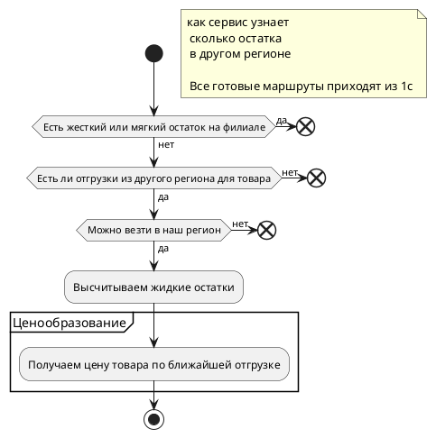

## Проработка
## Бизнес-логика
#### Мягкий резерв
##### Алгоритм "Обход-блокировка"
При расчете наличия учитывается резерв, который мы называем _отрицательным_. 
Объяснение отрицательного остатка: К нему мы относимся, как если на этот магазин сделали заказ, но еще не отняли остаток там, откуда будут везти товар. 
Решение: Поэтому перед вычислением наличия, мы пытаемся догадаться откуда будут везти товар, и там сами отнимаем (блокируем) остаток: 
- отнимаем на филиалах
- отнимаем на ТВП 
Обработку отрицательного резерва требуется произвести на всех магазинах, где он есть, даже если наличия требуется вычислить на каком-нибудь другом магазине. Наличие отрицательного остатка на магазинах приводит к тому, что на других филиалах остатка для мягкого становится меньше. 
Алгоритм называется _Обход-блокировка_, потому что мы обходим маршруты и блокируем остаток.
#### Витринный образец
В системе 1С хранится информация о том, что товар выставлен на витрину.
Данная информация приходит обменом на сайт.
##### Показ плашки "Витринный образец"
###### Модал наличия.
На филиале **сравнивается количество** доступного **жесткого остатка** **и** **количество витринных образцов**.
**Если на филиале** количество **витринных >= жестких, то отображается** информация о том **что товар является витринным** образцом.
**Для группы товаров** данная механика **не реализована**.
###### Закажи со склада, забери в магазине и в чекауте
Если для витринного образца доступна дисконтная логистика, то отображается "Закажи со склада, забери в магазине"
#### Дисконтная логистика

> [!NOTE] Вырезание логики дисконтной логистики в будущем 
> Планируется полный переход сайта на витринность.
> Дисконтная логистика будет вырезана из сайта

Предоставление пользователю возможность купить товар в запечатанной упаковке от производителя и получить на него скидку.
##### Логика работы модуля discountLogistic (Дисконтная логистика)
Остатки "в наличии" можно показывать только для магазинов Технопоинт и РРЦ.
Мягкие остатки можно перевозить только с филиалов определенных типов (настраивается в админке сайта [http://backend.dns-shop.ru/core/site/module-settings/?id=discountLogistic](http://backend.dns-shop.ru/core/site/module-settings/?id=discountLogistic)), текущие настройки:
Тип                                  UUID  
Дисконт центр             cb10c608-f039-4010-afc7-a5ea4352c6dc  
Товарный терминал    6ed24222-3fc7-4126-9bee-f34b6a37fad1  
Сборочный цех            aef98215-0288-4863-aaae-3c4567cca41f  
РРЦ                                 ebb4edce-cb57-417a-9f64-02607b5f52ad
##### Применение в корзине
Модуль discountLogistic (Дисконтная логистика) включает в себя две составляющие: 
1) Дисконтная логистика - можно включить в корзине для заказа, если выполняются необходимые условия. Если включить дисконтную логистику для заказа, то товары будут доставлены со склада (в заводской упаковке).
2) Интернет-цена - можно включить в корзине для заказа, если выполняются необходимые условия. Если включить интернет-цену для заказа, то:
	- товары будут доставлены со склада (в заводской упаковке)
	- к товару будет применена скидка в размере: "Цена товара" - "Интернет-цена товара"
#### Межрегиональная логистика
##### Логика работы межрегиональных остатков

###### ==учитывать ценник другого региона==
Показывать цену, которая актуальна для товара из которого везем товар.
## Системная логика
#### Остатки состоят из трех модулей:
1) Демон остатков - обрабатывает обмен и записывает информацию об остатках
2) Сервис остатков - предоставляет информацию о текущих остатках
3) Мир остатков - используется для карточки товара.

Репозиторий сервиса остатков:
[https://git.dns-shop.ru/go_scripts/in-stock-service](https://git.dns-shop.ru/go_scripts/in-stock-service)
Информация о жёстких остатках, маршрутах (в том числе маршрутах ТВП), приходит на сайт обменом через Кафку.
Информация остатках товаров в путях, ограничениях МГХ и логистики приходят в базу сайта обменом из 1С.
Информация об остатках отображается в виджете товара, карточке товара, корзине, модальном окне наличия товара, модальном окне выбора магазина в чекауте.
#### 